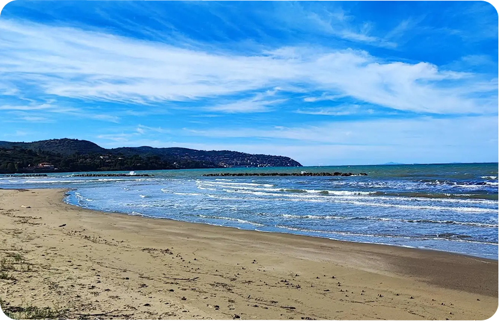

<!-- HERO / INTRO -->
<figure style="margin-bottom:40px;">
  
  <figcaption style="font-size:14px; color:#718096; margin-top:12px; font-style:italic; text-align:center;">Strategic marketing is the difference between a vacant property and a high-yield investment.</figcaption>
</figure>

<strong>Vacation Rental Marketing & Growth</strong>

The global **vacation rental market** has undergone a radical transformation over the last few years. In 2026, simply listing your property on a major platform is no longer enough to guarantee a return on investment. As the industry matures, the distinction between "hosting" and "high-performance asset management" has become the defining factor for luxury villa owners.

To truly **advertise vacation rental** properties in a way that commands premium rates, you must think beyond the basic amenities. You are no longer just selling a bed; you are selling an aspirational digital product. Whether you are managing **cape coral vacation rental homes**, a sprawling estate in the **vacation rental tahoe** region, or a sophisticated **vacation rental atlanta** penthouse, the principles of digital growth and conversion optimization remain the same.

This guide is designed for the high-end property owner and the professional operator who understands that **vacation rental management** is increasingly a game of digital visibility and brand authority. We aren't talking about cleaning schedules or key handovers—those are operational basics. We are talking about the strategic layers of marketing that move the needle on your bottom line.

<aside style="background:#f0faf4;border-left:4px solid #38a169;border-radius:8px;padding:24px 28px;margin:32px 0;">

What You'll Learn in This Guide

<ul style="list-style:none;padding:0;margin:0;">
<li style="padding:6px 0;">The architecture of a high-converting **vacation house rental website**.</li>
<li style="padding:6px 0;">Distribution strategies for saturated **vacation rental markets**.</li>
<li style="padding:6px 0;">How to leverage **vacation property rental management** data to drive ADR.</li>
<li style="padding:6px 0;">Advanced SEO tactics for hyper-local keywords like **vacation rental pcb** or **vacation rental st augustine**.</li>
</ul>
</aside>

---

## Table of Contents
- [1. The Digital Foundation: Your Direct Booking Engine](#1-the-digital-foundation-your-direct-booking-engine)
- [2. Platform Mastery: Dominating the OTAs](#2-platform-mastery-dominating-the-otas)
- [3. Hyper-Local SEO: Capturing Niche Demand](#3-hyper-local-seo-capturing-niche-demand)
- [4. The Luxury Content Flywheel](#4-the-luxury-content-flywheel)
- [5. The 2026 Tech Stack for High-Performance Growth](#5-the-2026-tech-stack-for-high-performance-growth)
- [6. Revenue Strategy and Data Intelligence](#6-revenue-strategy-and-data-intelligence)
- [7. Navigating the Management Landscape](#7-navigating-the-management-landscape)

---

## 1. The Digital Foundation: Your Direct Booking Engine

If you rely solely on third-party **rental websites vacation** seekers use, you are essentially renting your business from a landlord. While Airbnb, VRBO, and Booking.com are essential for discovery, your primary asset should be your own **vacation house rental website**.

A professional **vacation rental company** knows that a direct booking site isn't just a vanity project; it's a conversion tool. When potential guests find you on an OTA, the savvy ones will often search for your property name on Google. If they find a sleek, secure, and user-friendly site that offers a direct-booking incentive, you've just saved yourself 15% in platform fees.

### Technical Requirements for Your Website:
- **Lightning-Fast Load Times:** High-net-worth individuals have low patience. Your 4K images of that **big sky vacation rental** must be optimized for speed.
- **Mobile-First UX:** Over 70% of **short term vacation rental** searches now happen on mobile devices.
- **Trust Signals:** SSL certificates, professional photography, and integrated reviews are non-negotiable.
- **Deep SEO Integration:** You need dedicated landing pages for your specific markets, whether that’s **santa fe vacation rental homes** or **rockport vacation rental** cabins.

<aside style="background:#fffbf0;border-left:4px solid #c5a47e;border-radius:8px;padding:20px 24px;margin:28px 0;">

Expert Tip

Use your direct site to tell the story of the property. OTAs limit your narrative; your own site allows you to sell the lifestyle of a 5+ bedroom villa with immersive video and local area guides.

</aside>

Expanding your direct booking strategy involves more than just a "Book Now" button. It requires a sophisticated understanding of the guest journey. For instance, if you **manage vacation rental** properties in a highly seasonal area like **stowe vt**, your website content should dynamically shift to highlight the "Peak Foliage" experience in autumn and the "Apres Ski" luxury in winter. This level of intentionality is what separates a generic listing from a premium brand.

---

## 2. Platform Mastery: Dominating the OTAs

To **manage vacation rental** visibility effectively, you must understand the algorithms of the major **vacation home rental websites**. These platforms prioritize properties that they know will convert.

A **vacation rental agency** that succeeds in 2026 doesn't just "set and forget" their listings. They engage in continuous optimization. This means:
1. **Dynamic Pricing:** Using tools that adjust rates based on local events in places like **vacation rental stowe vt** or during peak season in **surf city**.
2. **Review Velocity:** High-quality **vacation rental companies** prioritize getting a review within 48 hours of checkout to keep their algorithm ranking high.
3. **Instant Book & Response Rates:** The faster you respond, the higher you rank.

### The Algorithm Deep Dive
The major **vacation rental companies** (Airbnb, VRBO) use machine learning to rank properties. One of the most critical, yet often overlooked, factors is "Click-Through Rate (CTR) to Booking" ratio. If 1,000 people see your **vacation rental la** listing but only 1 person books, the platform will bury you. 

To combat this, your "Hero Image" must be tested. A professional **vacation rental company** will A/B test different main photos to see which one drives more clicks. For a **big sky vacation rental**, is it the snow-capped peaks from the balcony or the roaring fireplace in the master suite? Data will tell you what your gut cannot.

---

## 3. Hyper-Local SEO: Capturing Niche Demand

One of the biggest mistakes we see in **property management vacation rental** marketing is a lack of local focus. Broad keywords are too competitive. To **advertise vacation rental** properties successfully, you need to go deep into regional search intent.

Consider these different **vacation rental markets**:
- **The Coastal Play:** If you have a **vacation rental pcb** (Panama City Beach) or a **vacation rental surf city** property, your content should focus on beach access, water sports, and local seafood.
- **The Mountain Play:** For a **vacation rental tahoe** or **vacation rental stowe vt**, the focus shifts to seasonal activities—skiing in winter, hiking in summer.
- **The Urban Play:** A **vacation rental la** or **vacation rental atlanta** property needs to highlight proximity to business hubs, nightlife, and culture.

By creating content around these specific terms—like "luxury **cape coral vacation rental homes** for large groups"—you capture high-intent traffic that is much more likely to convert than someone searching for "vacation house."

### Case Study: Vacation Rental St Augustine
In a historical market like **st augustine**, guests are looking for "character" and "proximity." A marketing strategy that targets "vacation rental st augustine" should highlight the walking distance to St. George Street or the private courtyard architecture. By mirroring the local search intent, you position your property as the obvious choice for that specific **short term vacation rental** market.

---

## 4. The Luxury Content Flywheel

For properties with 5+ bedrooms, your marketing needs to reflect the scale of the experience. High-end guests aren't just booking a place to sleep; they are booking a venue for a multi-generational reunion, a corporate retreat, or a milestone celebration.

This is where many **vacation rental agencies** fall short. They use generic photos and boring descriptions. To truly **advertise vacation rental** excellence, you need a content flywheel:
- **Professional Video Tours:** Drone shots and walkthroughs that show the flow of the house.
- **Local Expert Guides:** "The Best Private Chefs in **St Augustine**" or "The Most Exclusive Hikes in **Big Sky**."
- **Social Proof:** Highlighting guest stories and influencer collaborations.

A **vacation rental management** strategy that ignores social media is incomplete. Instagram and TikTok are now powerful search engines for travel. If your **vacation rental st augustine** property isn't "Instagrammable," you're losing a massive segment of the 2026 market. 

Luxury guests also value technical precision in property descriptions. Instead of "big kitchen," use "Chef-grade kitchen featuring Sub-Zero refrigeration and Wolf range, optimized for private catering." This technical language appeals to the high-end demographic searching for **santa fe vacation rental homes** or **rockport vacation rental** estates.

---

## 5. The 2026 Tech Stack for High-Performance Growth

In the current **vacation rental market**, your tech stack is your competitive advantage. If you are still using spreadsheets to **manage vacation rental** bookings, you are already behind. 

### Essential Tools for Property Management Vacation Rental Success:
1. **Property Management System (PMS):** This is your "Source of Truth." It syncs your calendar across all **vacation home rental websites** to prevent double bookings.
2. **Channel Manager:** Distributes your listing to niche **rental websites vacation** seekers use beyond the "Big Three."
3. **Dynamic Pricing Engines:** Essential for staying competitive in volatile **vacation rental markets** like **Tahoe** or **PCB**.
4. **Guest Experience Apps:** Digital house manuals that upsell services (private chefs, mid-stay cleans, late checkouts).

A **vacation rental company** that leverages AI for guest communication can maintain a 100% response rate without the overhead of a 24/7 call center. This efficiency allows you to scale from one **vacation rental atlanta** property to a portfolio across multiple **vacation rental markets** seamlessly.

---

## 6. Revenue Strategy and Data Intelligence

Success in the **vacation rental market** is no longer about gut feeling; it’s about data. The most successful **vacation rental companies** use sophisticated software to track:
- **Lead Time:** When are guests booking their **santa fe vacation rental homes**?
- **Booking Window:** How far in advance should you increase rates for **rockport vacation rental** peak seasons?
- **Comp Set Analysis:** Who are your true competitors in the **vacation rental la** space?

A professional **vacation property rental management** firm (on the marketing side) will look at your RevPAR (Revenue Per Available Room) and ADR (Average Daily Rate) with the same scrutiny as a luxury hotel. If your **vacation rental stowe vt** property is 100% booked but your rates are 30% lower than the house next door, you aren't winning—you're leaving money on the table.

### Understanding Market Elasticity
Different **vacation rental markets** have different price elasticities. For example, the **vacation rental pcb** market might be highly sensitive to price during spring break, whereas a **big sky vacation rental** during peak ski season might see guests willing to pay a massive premium regardless of slight price hikes. Knowing where your property sits on this curve is the key to maximizing revenue.

---

## 7. Navigating the Management Landscape

There is often confusion between **property management vacation rental** (operations) and **vacation rental management** (marketing/strategy). At IndaVillas, we focus on the latter. While the boots-on-the-ground team handles the towels and the toilets, the marketing team handles the digital growth.

### Choosing Between Vacation Rental Management Companies
When looking at **vacation rental management companies**, you need to ask:
- "What is your specific strategy to **advertise vacation rental** properties on Google?"
- "Do you have a dedicated SEO team for my specific **vacation rental markets**?"
- "How do you handle distribution across various **rental websites vacation** seekers use?"

A high-performing **vacation rental company** should be able to show you a clear roadmap of how they plan to move you from 40% occupancy to 70%+ while increasing your nightly rate. This isn't just about getting "more bookings"—it's about getting the *right* bookings. A high-quality **vacation rental agency** will vet guests to ensure your **cape coral vacation rental homes** are protected while still hitting your financial targets.

---

## The IndaVillas Perspective: Beyond the Listing

At IndaVillas, we believe that the next decade of luxury hospitality will be won by those who treat their digital presence as seriously as their physical property. Whether you are managing a portfolio of **cape coral vacation rental homes** or a single, high-end **vacation rental tahoe** estate, the goal is the same: maximum visibility, maximum conversion, and maximum revenue.

Don't settle for being another dot on a map. Turn your property into a destination.

### Ready to Scale Your Villa's Revenue?

If you are a luxury property owner looking to move beyond basic hosting and into the world of professional digital growth, we can help. IndaVillas specializes in:
- **High-Performance SEO:** Dominating local and national searches.
- **Listing Optimization:** Turning views into bookings.
- **Revenue Strategy:** Data-backed pricing that beats the market.
- **Content Marketing:** Building a brand that guests seek out by name.

**Stop just listing. Start winning.**

[Contact IndaVillas today to discuss your digital growth strategy.](https://indavillas.com/contact)

---

## Final Keyword Checklist for Your Strategy:
- **Advertise vacation rental** properties with a focus on intent.
- Capture the **vacation rental market** by going hyper-local (**vacation rental pcb**, **vacation rental atlanta**).
- Build a robust **vacation house rental website** to own your data.
- Partner with the right **vacation rental management** experts who understand luxury.
- Monitor **vacation rental markets** and adjust your strategy in real-time.

Whether it's a **big sky vacation rental** or a home in **rockport**, your success depends on your ability to be found, be trusted, and be booked. Let's get to work.
