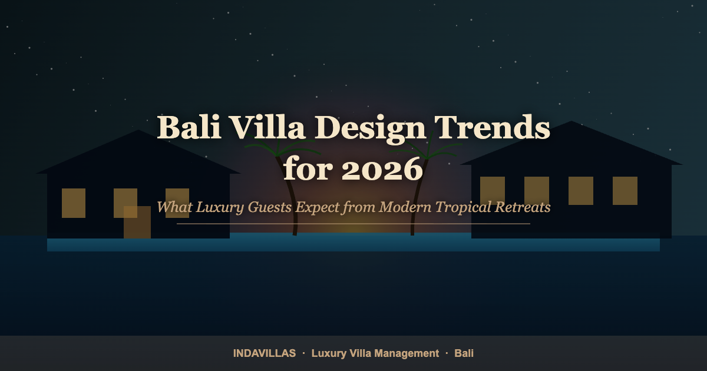

<!-- HERO / INTRO -->
<figure style="margin-bottom:40px;">
  
  <figcaption style="font-size:14px; color:#718096; margin-top:12px; font-style:italic; text-align:center;">The modern Bali luxury villa blends architectural drama with the lush tropical landscape around it.</figcaption>
</figure>

<strong>Villa Design & Guest Experience</strong>

The Bali luxury villa market has never been more competitive — or more exciting. As a new wave of design-literate, experience-hungry travellers descends on the island, the properties that command premium rates and consistent five-star reviews are those that have evolved beyond the postcard-perfect infinity pool and the generic tropical aesthetic.

In 2026, luxury guests are not simply looking for a beautiful place to stay. They are seeking an immersive, intentional environment — one that reflects a clear design philosophy, delivers genuine wellness benefits, and anticipates their needs before they articulate them. Understanding and responding to these evolving expectations is the single greatest lever a villa owner can pull to increase both occupancy and nightly rate.

This article identifies the seven defining design and amenity trends shaping Bali's luxury villa market in 2026, with practical guidance on how to integrate each one into your property.

<aside style="background:#f0faf4;border-left:4px solid #38a169;border-radius:8px;padding:24px 28px;margin:32px 0;">

What You'll Learn in This Article

<ul style="list-style:none;padding:0;margin:0;">
<li style="padding:6px 0;">The biophilic design principles that top Bali villas are embracing.</li>
<li style="padding:6px 0;">Why wellness spaces are now a non-negotiable for luxury guests.</li>
<li style="padding:6px 0;">How smart home technology is redefining the premium villa experience.</li>
<li style="padding:6px 0;">The outdoor living design philosophy that earns five-star reviews.</li>
</ul>
</aside>

---

## Table of Contents
- [1. Biophilic Architecture and Living Materials](#1-biophilic-architecture-and-living-materials)
- [2. Dedicated Wellness Spaces](#2-dedicated-wellness-spaces)
- [3. Smart Home Integration](#3-smart-home-integration)
- [4. The New Outdoor Living Standard](#4-the-new-outdoor-living-standard)
- [5. Locally Sourced and Artisan Interiors](#5-locally-sourced-and-artisan-interiors)
- [6. Conscious Sustainability Features](#6-conscious-sustainability-features)
- [7. The Private Pool Reinvented](#7-the-private-pool-reinvented)

---

## 1. Biophilic Architecture and Living Materials

The most transformative design shift in Bali's luxury villa sector over the past two years is the move from villa-as-showcase to villa-as-living-ecosystem. Biophilic design — the intentional integration of natural elements, materials, and systems into the built environment — has evolved from a niche architectural philosophy into the defining aesthetic of the island's most photographed and most booked properties.

In practical terms, this means moving well beyond the requisite tropical garden. The villas that are generating genuine editorial and organic social media coverage in 2026 feature open structural elements that allow the natural soundscape to permeate indoor living areas, interior planting walls that serve as both air filtration and visual focal points, and the use of raw and reclaimed natural materials — hand-hewn volcanic stone, recycled teak, river-washed pebble flooring — as primary architectural features rather than decorative accents.

<aside style="background:#fffbf0;border-left:4px solid #c5a47e;border-radius:8px;padding:20px 24px;margin:28px 0;">

Design Insight

Properties featuring prominent biophilic design elements see a measurable increase in spontaneous social media sharing from guests — a form of marketing that cannot be purchased.

</aside>

The guest psychology behind this trend is well-documented. Research consistently demonstrates that exposure to natural materials and living systems significantly reduces cortisol levels and promotes the psychological state guests associate with genuine relaxation. A villa that feels like a curated extension of the Balinese landscape delivers this benefit from the moment of arrival.

---

## 2. Dedicated Wellness Spaces

The post-pandemic luxury traveller has redefined what "relaxation" means at a premium price point. A well-appointed bathroom and a good mattress are no longer differentiating features — they are baseline expectations. What luxury guests in 2026 are actively seeking, and willing to pay a meaningful premium for, is dedicated wellness infrastructure.

The wellness hierarchy for Bali luxury villas now extends well beyond a yoga mat left in the bedroom wardrobe. At the entry-level luxury tier, guests expect a designated yoga and meditation platform — preferably with an open-air rice terrace or jungle view — and a high-quality outdoor shower with both hot and cold settings. At the premium tier, properties are incorporating private plunge pools with temperature control, dedicated massage and treatment salas that can be activated through the villa's concierge service, and, increasingly, cold exposure facilities in the form of ice bath installations.

The operational implication for villa owners is that these wellness amenities require both physical space allocation at the design stage and ongoing management infrastructure. A cold plunge that is not maintained correctly, or a massage sala that guests cannot easily access through the property management system, creates frustration rather than delight.

---

## 3. Smart Home Integration

The luxury hospitality technology standard has shifted significantly, driven by two converging factors: the maturing of smart home hardware into genuinely reliable consumer-grade products, and the expectation of seamless digital control established by premium hotel brands.

For a Bali luxury villa in 2026, the minimum smart home standard includes app-controlled air conditioning and lighting, a high-quality integrated sound system operable from a single mobile interface, automated pool lighting and temperature management, and a smart TV system with seamless streaming service integration. At the premium tier, guests expect voice-activated room controls, motorised blinds and louvres on the outdoor pavilion, and a villa-specific digital concierge portal that handles everything from additional towel requests to private chef bookings.

The critical operational consideration is reliability. Smart home systems that require technical troubleshooting instructions on arrival, or that fail intermittently, generate disproportionately negative guest responses. Every smart feature must be tested rigorously before each stay and must have a frictionless manual override for when technology behaves unexpectedly.

---

## 4. The New Outdoor Living Standard

Bali's climate is its most marketable asset, and the villas that understand this most deeply are those that have designed their outdoor living environments with the same rigour and intentionality applied to their interior spaces. The new outdoor living standard for luxury Bali villas is not about square footage — it is about the quality of the outdoor experience at every hour of the day.

This means covered outdoor dining areas that remain comfortable in both midday heat and evening rain, with genuine restaurant-quality lighting that transforms the dinner setting after dark. It means day beds positioned to capture the most photogenic angles of the pool and garden, with shade structures that allow them to be used throughout the afternoon. And it means outdoor kitchens and bar areas that make it feel natural and enjoyable to spend an entire day on the villa grounds without the impulse to leave.

The villas consistently receiving unsolicited five-star references to their outdoor spaces are those where the exterior has been designed as a deliberate sequence of experiences — a journey through the property rather than a single static view.

---

## 5. Locally Sourced and Artisan Interiors

In a market that has long been populated by properties decorated with generic "Balinese" pieces acquired from the same commercial export warehouses, the villas achieving true design distinction in 2026 are those committed to genuinely local and artisan sourcing for their interiors.

This trend is driven as much by guests as by designers. Luxury travellers in 2026 are globally informed and design-literate. They can identify mass-produced "artisan" pieces. They recognise and respond — with both their reviews and their photography — to spaces that feel genuinely curated, where the ceramics have a maker's mark, where the textiles connect to a specific regional tradition, and where the furniture tells a provenance story that the villa host can articulate.

Practically, this means building relationships with Balinese craftspeople and small studios, commissioning bespoke pieces for key visual moments in the villa, and creating the documentation — through the digital property guide and in-person from the villa manager — that allows guests to understand and appreciate what they are surrounded by.

---

## 6. Conscious Sustainability Features

Environmental consciousness is no longer a differentiating luxury — it is an emerging baseline expectation among the high-value guest demographics that drive Bali's premium villa market. The guests who book the most expensive villas, for the longest stays, are disproportionately likely to make sustainability a factor in their decision-making.

The practical sustainability features that are now expected at the luxury villa tier include solar power generation with visible capacity metrics available to guests, a filtration system that eliminates single-use plastic water bottles throughout the stay, a demonstrable composting and waste separation programme, and garden and landscape design that uses indigenous species requiring minimal irrigation.

Beyond these operational features, the sustainability story requires communication. Guests who care about environmental impact want to understand what the villa is doing and why. A brief, beautifully presented sustainability section in the digital property guide — written with genuine specificity rather than generic "eco-friendly" language — converts environmental investment into tangible guest satisfaction and differentiation.

---

## 7. The Private Pool Reinvented

Bali's iconic infinity pool remains the centrepiece of almost every luxury villa's marketing imagery. But in a market where nearly every property can show a clean blue rectangle with a jungle or rice terrace backdrop, the pools that now generate the most sharing and the most booking enquiries are those that have been reimagined beyond the rectangle.

The design directions earning the most attention in 2026 include pools with natural edge detailing using volcanic stone, curved pool forms that create a more organic relationship with the surrounding landscape, swim-up seating areas that blur the boundary between pool and outdoor living space, and shallow sun shelf areas specifically designed for the social and photogenic moments that have become a guest expectation.

Pool lighting is equally important. Underwater LED systems that allow the pool to transition from day amenity to atmospheric evening focal point — with colour temperature control available through the villa's smart home system — have become a standard feature of properties positioning themselves at the premium tier.

---

<aside style="background:#f7f0ff;border-left:4px solid #805ad5;border-radius:8px;padding:24px 28px;margin:32px 0;">

Elevate Your Villa with IndaVillas

Whether you are repositioning an existing property or developing a new villa, IndaVillas provides end-to-end design advisory, property management, and guest experience optimisation services. <a href="https://indavillas.com/bali-villa-management" style="color:#553c9a;font-weight:600;">Explore our villa management services →</a>

</aside>

---

## Frequently Asked Questions

**Which design trend delivers the highest ROI for Bali villa owners?**

Smart home integration and dedicated wellness spaces consistently deliver the strongest return on investment, both in terms of nightly rate justification and review quality. Guests who experience genuinely seamless smart home technology and a well-designed wellness space are significantly more likely to leave five-star reviews and make repeat bookings.

**How much does it cost to retrofit biophilic design elements into an existing villa?**

Costs vary widely depending on scope, but meaningful biophilic enhancement — a living wall installation, upgraded natural material surfaces, and improved interior planting — can typically be achieved for between USD $8,000 and $25,000 for a standard luxury villa. The return in photography quality and organic social sharing alone justifies the investment for most properties.

**Is sustainability certification worth pursuing for a Bali luxury villa?**

Formal certification programmes exist but are not yet widely recognised by villa guests as a direct booking motivator. More effective is a clear, specific sustainability narrative communicated through the villa's marketing materials and digital property guide. The investment in sustainable operations delivers the greatest return when it is made visible and legible to guests.

---

*About the Author: The IndaVillas Team specialises in luxury property operations in Bali. With extensive experience in high-end hospitality, they help villa owners maximise yields and guest satisfaction by combining premium design standards with intelligent automation. Connect at [IndaVillas.com](https://indavillas.com).*

