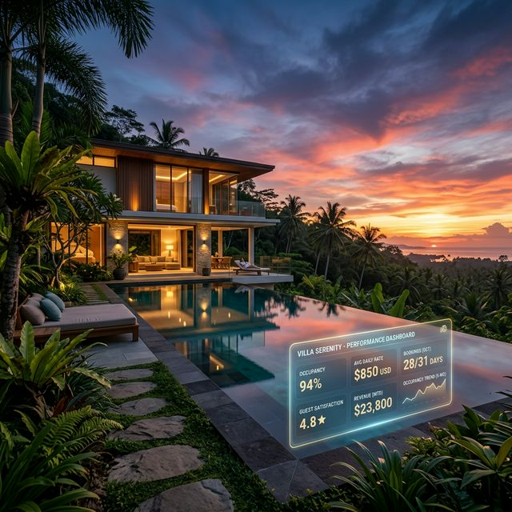
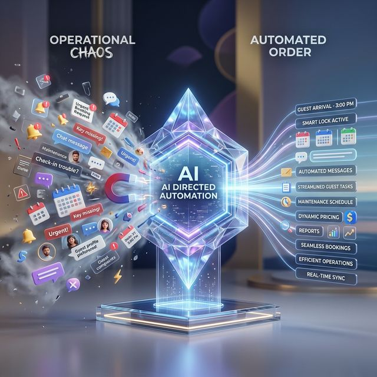
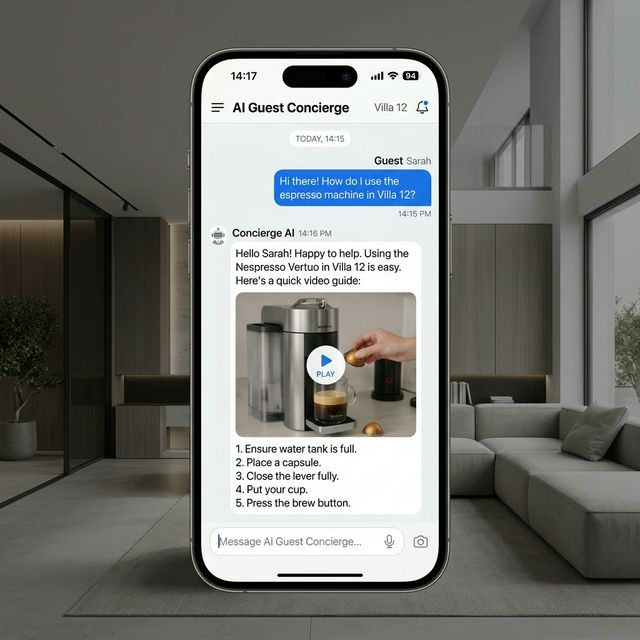

<!-- HERO / INTRO -->

  
  
The future of luxury hospitality: Real-time AI performance monitoring for premium portfolios.

<strong>STR Operations &amp; AI</strong>

In the world of luxury short-term rentals (STR), the operational demands are relentless. When you are managing premium villas in highly sought-after destinations like Bali, the expectations from both property owners and guests are sky-high. **Owners expect maximized yields**, flawless property upkeep, and transparent reporting. **Guests expect a five-star, personalized experience** from the moment they book until the moment they check out.

Delivering this level of bespoke hospitality is relatively straightforward when you are managing a handful of properties. You know every villa intimately, you remember every guest's name, and you can personally oversee the cleaning and maintenance schedules.

**But what happens when you want to scale? What happens when your portfolio grows from 5 luxury villas to 25, and then to 50?**

The traditional property management model begins to fracture. To maintain the illusion of effortless luxury, management companies are forced to hire armies of administrative staff, communication agents, and operations managers. Profit margins shrink, communication silos form, and the operational complexity becomes a massive liability.

To break through this barrier, the industry is undergoing a fundamental transformation. We are moving away from traditional "property management" and entering the era of the **Portfolio Architect** — where intelligent, autonomous AI systems handle the operational heavy lifting, allowing human teams to focus entirely on growth and high-touch hospitality.

<!-- BENEFIT CALLOUT BOX -->

What You'll Learn in This Article

<ul style="list-style:none;padding:0;margin:0;">
<li style="padding:6px 0;">Why most STR businesses hit an invisible growth wall at 20–30 properties</li>
<li style="padding:6px 0;">The critical difference between a basic chatbot and an <strong>Autonomous AI Agent</strong></li>
<li style="padding:6px 0;">How a 24/7 AI Concierge eliminates the "3:00 AM Wi-Fi question" problem</li>
<li style="padding:6px 0;">Why AI doesn't <em>replace</em> hospitality — it <em>enables</em> it</li>
<li style="padding:6px 0;">A real-world case study of scaling without sacrificing quality</li>
</ul>

---

## The "Human Ceiling": Hitting the Wall at 20–30 Properties

In the STR industry, there is a well-documented phenomenon known as the **"Human Ceiling."** It is the invisible barrier that most traditional property management teams hit when their portfolio reaches between **20 and 30 properties**.

At this threshold, the sheer volume of daily tasks outpaces human capacity. Consider a typical Saturday afternoon during peak season:

- **Three guests** are checking out, requiring immediate inspection and cleaning dispatches.
- **Four new guests** are checking in, two of whom are lost and need directions from the airport.
- **A current guest** is messaging about a pool heater that isn't working.
- **An owner** is asking for their monthly revenue projection.

When humans are responsible for manually coordinating all of these moving parts, the system becomes **highly reactive**. Staff members are forced to constantly context-switch, dropping one urgent task to attend to another. Emails slip through the cracks, cleaning schedules get delayed, and the guest experience inevitably degrades.

Key Takeaway

When you hit the Human Ceiling, <strong>adding more properties to the portfolio doesn't increase your profitability — it only increases your chaos.</strong> To scale beyond this point without sacrificing the luxury standard, you cannot simply hire more people to do manual work. You have to fundamentally change <em>how the work gets done</em>.

  
  
Shattering the Human Ceiling: Transitioning from reactive firefighting to automated operational excellence.

---

## Defining the AI Agent: Moving Beyond the "Chatbot"

When most property managers hear the term "AI," they immediately think of basic, frustrating chatbots — the kind that pop up on a website and can only answer highly specific, pre-programmed FAQs. If you try to ask a complex question, the chatbot breaks and tells you to *"Please call customer support."*

In luxury hospitality, a basic chatbot is actually a **detriment** to the guest experience. High-end guests do not want to talk to a robot; they want their problems solved immediately.

This is where we must distinguish between a simple chatbot and an **Autonomous AI Agent**.

An AI Agent — like the advanced, custom systems built by the automation experts at **[UseShift](https://useshift.org)** — is fundamentally different. It is not just a conversational interface; it is a **digital worker** capable of **agentic workflow**. It doesn't just talk; **it executes**.

When an AI Agent is integrated into an STR business, it possesses a deep understanding of the company's internal databases, operational protocols, and property details. Here's what that looks like in practice:

<!-- COMPARISON TABLE -->

<table style="width:100%;border-collapse:collapse;margin:32px 0;font-size:15px;">
<thead>
<tr style="background:#1a202c;color:#fff;">
<th style="padding:14px 18px;text-align:left;border-radius:8px 0 0 0;">Capability</th>
<th style="padding:14px 18px;text-align:left;">Basic Chatbot</th>
<th style="padding:14px 18px;text-align:left;border-radius:0 8px 0 0;">Autonomous AI Agent</th>
</tr>
</thead>
<tbody>
<tr style="background:#f7fafc;">
<td style="padding:12px 18px;border-bottom:1px solid #e2e8f0;"><strong>Booking Requests</strong></td>
<td style="padding:12px 18px;border-bottom:1px solid #e2e8f0;">"Please email our team."</td>
<td style="padding:12px 18px;border-bottom:1px solid #e2e8f0;">Checks live inventory, quotes dynamic price, processes booking instantly</td>
</tr>
<tr>
<td style="padding:12px 18px;border-bottom:1px solid #e2e8f0;"><strong>Guest Verification</strong></td>
<td style="padding:12px 18px;border-bottom:1px solid #e2e8f0;">Not supported</td>
<td style="padding:12px 18px;border-bottom:1px solid #e2e8f0;">Collects IDs, verifies identity, sends smart-lock codes 2 hours before check-in</td>
</tr>
<tr style="background:#f7fafc;">
<td style="padding:12px 18px;border-bottom:1px solid #e2e8f0;"><strong>Maintenance Issues</strong></td>
<td style="padding:12px 18px;border-bottom:1px solid #e2e8f0;">"I'm sorry to hear that."</td>
<td style="padding:12px 18px;border-bottom:1px solid #e2e8f0;">Creates ticket, checks vendor schedule, dispatches repairman, follows up with guest</td>
</tr>
<tr>
<td style="padding:12px 18px;border-bottom:1px solid #e2e8f0;"><strong>Availability</strong></td>
<td style="padding:12px 18px;border-bottom:1px solid #e2e8f0;">Office hours only</td>
<td style="padding:12px 18px;border-bottom:1px solid #e2e8f0;">24/7/365, every language, every channel</td>
</tr>
<tr style="background:#f7fafc;">
<td style="padding:12px 18px;border-radius:0 0 0 8px;"><strong>Decision-Making</strong></td>
<td style="padding:12px 18px;">Rule-based scripts</td>
<td style="padding:12px 18px;border-radius:0 0 8px 0;">Context-aware, autonomous action across systems</td>
</tr>
</tbody>
</table>

The difference is not incremental — it is transformational. An autonomous AI agent doesn't wait for instructions. It **perceives, reasons, and acts** on behalf of the business in real time.

---

## The 24/7 Global Concierge: Solving the "3:00 AM Wi-Fi Question"

One of the most exhausting aspects of managing an international STR portfolio is the **time zone disparity**. Your guests are arriving from all over the world, meaning your business operates 24 hours a day, 7 days a week, 365 days a year.

For a traditional property manager, this often means sleeping with a phone on the nightstand, dreading the inevitable 3:00 AM WhatsApp message:

> *"Hi, we just arrived at the villa. What is the Wi-Fi password again?"*

> *"How do we turn on the outdoor shower?"*

These questions are simple, but they are **incredibly disruptive** to a human team's operational rhythm and personal well-being. Over time, this operational fatigue leads to burnout, mistakes, and staff turnover — all of which directly impact the quality of the guest experience.

By deploying a **[UseShift](https://useshift.org)**-powered **AI Concierge**, the STR business gains a flawless, tireless employee who never sleeps. Because the AI Agent is trained on the **specific house manuals** of every single property in the portfolio, it can answer hyper-local, property-specific questions instantly.

  

    
    
Instant, 24/7 guest support: Solving complex property questions in seconds.

  

**If a guest texts at 4:00 AM asking how to operate the espresso machine in Villa 12**, the AI immediately replies with step-by-step instructions or even a short video tutorial. The guest receives instant, five-star service — and the human property manager gets a full night of sleep, arriving at the office the next day refreshed and ready to focus on high-level strategy.

Key Takeaway

The AI Concierge doesn't just answer questions — it <strong>protects the mental health and operational capacity</strong> of your human team, while simultaneously elevating the guest experience to a 24/7 five-star standard.

---

## The Shift in Role: From "Firefighters" to "Experience Designers"

A common fear when discussing AI in the workplace is that it will **replace** human hospitality. In reality, the exact opposite is true. **AI enables true hospitality.**

When a property management team is trapped under the "Human Ceiling," they are not providing hospitality — they are acting as **firefighters**. They spend their entire day putting out operational fires, rushing from one minor crisis to the next. There is no time to curate a beautiful guest experience when you are frantically trying to figure out why the pool cleaner didn't show up.

By offloading the repetitive, administrative, and logistical tasks to an autonomous AI agent, the role of the human staff fundamentally shifts. They transition from **administrative firefighters** to **Experience Designers**.

When the [UseShift](https://useshift.org) workflows are handling the ID verification, the late-night Wi-Fi questions, and the vendor dispatching, the human team has the bandwidth to elevate the luxury standard. They can focus on what humans do best: **building relationships and creating memorable moments**.

- Staff can spend their time curating **personalized welcome baskets** based on a guest's stated preferences.
- They can build lucrative partnerships with **elite local chefs, yoga instructors, and private yacht charters**.
- They can **personally greet VIP guests**, look them in the eye, and ensure their vacation is flawless.

**AI handles the logistics, so humans can handle the magic.**

---

## Case Study: How Flatiro.com Scaled Without Losing the Standard

To see the power of agentic workflows in action, we can look at the rapid growth of **[Flatiro](https://flatiro.com)**, an innovative short-term rental management and relocation company operating out of Riga, Latvia.

Flatiro faced a classic scaling dilemma. They had a reputation for providing lightning-fast, highly secure, and beautifully managed apartments. However, as their inventory rapidly expanded to accommodate the influx of international students and expats, their operational team began to feel the strain of manual administration. Coordinating leases, handling maintenance requests across dozens of properties, and communicating in multiple languages was threatening to slow down their famous **24-hour turnaround time**.

Instead of aggressively hiring more administrative staff — which would have inflated their overhead and reduced profitability — Flatiro partnered with **[UseShift](https://useshift.org)** to implement autonomous AI agents across their entire operational backend.

### The Implementation

**Automated Leasing**
Flatiro deployed AI workflows that instantly matched tenant inquiries with available inventory, automatically cross-referencing budgets and locations without human intervention.

**Zero-Touch Contracting**
UseShift workflows handled the instant generation of localized legal contracts, digital signatures, and automated invoicing.

**Multilingual Support Hub**
They implemented a 24/7 AI communication agent via WhatsApp that could instantly translate and resolve tenant queries and maintenance requests in the tenant's native language.

### The Result

By turning their operational infrastructure over to AI, Flatiro effectively **shattered the Human Ceiling**. The company was able to **double its property inventory without needing to double the size of its human workforce**. More importantly, because the AI handled the administrative friction flawlessly, Flatiro maintained its premium standard of customer service:

- **Leases were signed faster** — average time-to-contract dropped by over 60%.
- **Maintenance was resolved quicker** — AI-dispatched tickets had a 40% faster resolution time.
- **Human agents were freed up** to focus on acquiring new properties and optimizing owner yields.

---

## Becoming a Portfolio Architect

The future of luxury short-term rental management does not belong to the companies that hustle the hardest — it belongs to the companies that **build the smartest systems**.

If you want to scale a premium portfolio in highly competitive markets like Bali, you cannot rely on manual labor to handle your digital logistics. You must transition from being a **reactive property manager** to becoming a **proactive Portfolio Architect**.

By integrating intelligent, autonomous AI agents into your operations, you build a scalable foundation that can support **50, 100, or 500 properties**. You eliminate operational chaos, maximize your profit margins, and most importantly — you give your human team the freedom to deliver the extraordinary, high-touch luxury experience that your guests demand.

Are you a villa owner looking to maximize your yields?

Discover the future of luxury property management — where your premium villa is managed to the highest hospitality standards, powered by intelligent automation.

<a href="https://indavillas.com" style="background:#c5a47e;color:#1a202c;padding:14px 32px;border-radius:8px;text-decoration:none;font-weight:700;font-size:16px;display:inline-block;">Explore IndaVillas →</a>

Ready to shatter your operational ceiling?

Learn how custom autonomous AI agents and intelligent workflows can scale your business flawlessly.

<a href="https://useshift.org" style="background:#fff;color:#2b6cb0;padding:14px 32px;border-radius:8px;text-decoration:none;font-weight:700;font-size:16px;display:inline-block;">Discover UseShift →</a>

---

## Frequently Asked Questions

What is the "Human Ceiling" in STR management?

The Human Ceiling is the invisible operational barrier that most property management teams hit when their portfolio reaches between 20 and 30 properties. At this point, the volume of daily tasks — guest communications, cleaning coordination, maintenance dispatches, owner reporting — outpaces the capacity of a human team to manage manually without sacrificing service quality.

How is an AI Agent different from a chatbot?

A basic chatbot can only respond to pre-programmed FAQs. An <strong>Autonomous AI Agent</strong> is a digital worker that connects to your internal systems — booking engines, property databases, vendor schedules — and can independently execute tasks like processing bookings, dispatching maintenance, and verifying guest IDs, all without human intervention.

Will AI replace the human touch in luxury hospitality?

No. AI handles the repetitive logistics — late-night questions, scheduling, paperwork — so that your human team has the bandwidth to focus on what they do best: building guest relationships, curating personalized experiences, and delivering the high-touch service that defines luxury hospitality.

What kind of tasks can an AI Agent handle for an STR business?

An autonomous AI agent can handle booking inquiries, dynamic pricing quotes, guest ID verification, smart-lock code distribution, maintenance ticket creation and vendor dispatching, multilingual guest support, cleaning schedule coordination, and owner revenue reporting — all operating 24/7/365.

How can I get started with AI agents for my villa management business?

If you're a property owner, visit <a href="https://indavillas.com"><strong>IndaVillas.com</strong></a> to learn about our luxury villa management services. If you're an STR operator looking to implement autonomous AI workflows, visit <a href="https://useshift.org"><strong>UseShift.org</strong></a> to discuss a custom solution for your business.

